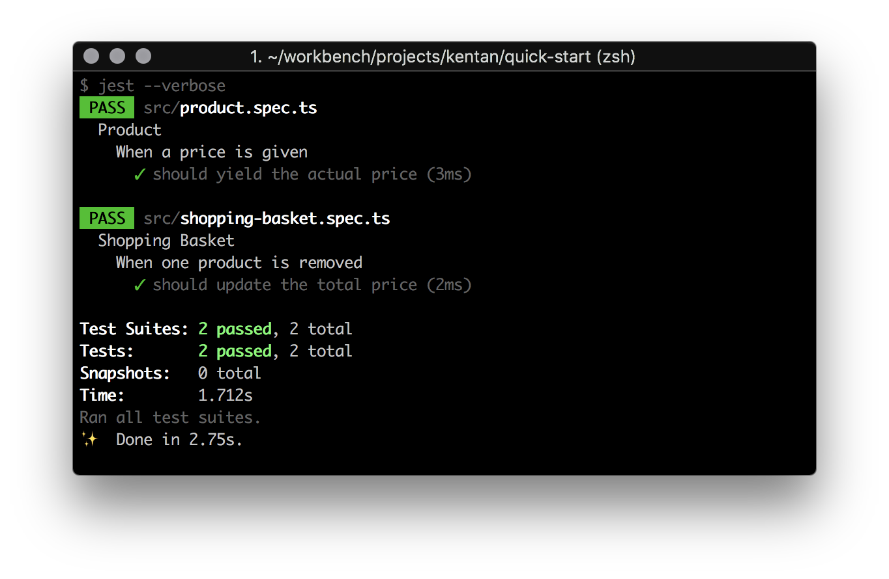

# Quick Start

Kentan comes in to play if you have complex nested data structures in your TypeScript Project. This library saves you a lot of lines of code and even more important it saves your time.

> In this tutorial you will refactor tests of an existing project to make them better to read and more maintainable.

## Get the Playground

To start quickly please clone the repository [quick-start](https://github.com/kentan-official/quick-start.git) and install the dependencies.

```bash
git clone https://github.com/kentan-official/quick-start.git
cd quick-start
npm install
```

> This project already contains a working test setup for [TypeScript](https://www.typescriptlang.org/) and [Jest](https://jestjs.io/).
> For this moment you do not need to care about how this works exactly.
> We want to focus on Kentan's features now.

### Execute Unit Tests

This playground provides two tests.
Each of them needs to be optimized concerning readability and maintainability.
Please execute the tests before we have a look on the code.

```bash
npm test
```

You will see that two test suites are executed.
The first has the name `Product` and the second suite is called `Shopping Basket`.
Each of them contains one test that passes.



## Installation

Before we get into the code please add `@kentan-official/core` to the project.

```bash
npm install --save-dev @kentan-official/core
```

## The Problem

Now it is time to open your favourite**code editor**.
The picture below displays the folder structure of the quickstart project.
Now we want to check if there is something we can do better in `src/product.spec.ts`.


Although the test is a very simple one, it should give you the idea of the problem we are facing if the test gets a little more complex.
Setting up the test data already costs a lot of lines of code.
At that very moment, we are not able to reuse that piece of test data in other unit tests.

```ts
// src/product.spec.ts

it('should yield the actual price', () => {
  const givenPrice = 300;

  const product: Product = {
    id: 1,
    title: 'XBox One',
    description: 'Gaming Console',
    priceInDollars: givenPrice
  };

  expect(product.priceInDollars).toBe(300);
});
```

!> We need to simplify the way how we arrange test data.
Even in this case, Kentan will help us to tidy up this unit test.

## The First Sketch

Let's go ahead and create our first Sketch.
Therefore please add a new file called `product.sketch.ts` to the project.

```bash
# Inside the quick-start project you can type
mkdir -p src/test/sketches && touch src/test/sketches/product.sketch.ts
```


?> All Sketches of your application are saved in one directory.
This makes it easy for your teammates to discover and reuse them.

### What is a Sketch?

The Sketch knows how to construct a `Model` and provides default data.
This enables you to use the generated data right away in your tests.
If you need to change some properties for certain test cases, you can use
a built-in API to achieve this.

The next snippet shows how a simple Sketch looks like.

```ts
// src/test/sketches/product.sketch.ts

import { Sketch } from '@kentan-official/core';
import { Product } from '../../product';

export class ForProduct extends Sketch<Product> {
  constructor() {
    super({
      id: 1,
      title: 'XBox One',
      description: 'Gaming Console',
      priceInDollars: 300
    });
  }
}
```

The package `@kentan-official/core` provides the class Sketch<T>.
This base class enables you to create a concrete Sketch for every model in your
project.<br/>
To specify the default data you need to pass an object to the `super`-call inside
the constructor of your Sketch.
Thanks to TypeScript you will get the full support of your code editor filling in
the needed properties


?> Creating a Sketch is nothing else than extract data into an own class.
Kentan just adds some functionality to reuse and configure that data in
multiple tests.

### Use the Sketch

We are now ready to simplify the product test.
A factory called `Kentan` allows you to use a Sketch.
Look what happens to our unit test.

```diff
# src/product.spec.ts

+ import { Kentan } from '@kentan-official/core';
+ import { ForProduct } from './test/sketches/product.sketch';
- import { Product } from './product';

...

    it('should yield the actual price', () => {
      const givenPrice = 300;
+     const product = Kentan.sketch(ForProduct).model();

-     const product: Product = {
-       id: 1,
-       title: 'XBox One',
-       description: 'Gaming Console',
-       priceInDollars: givenPrice
-     };

      expect(product.priceInDollars).toBe(givenPrice);
    });
```

Basically, the simple test gets even more simple.
The `it`-block just contains _three_ lines of code.
To retrieve them from the Sketch `Product` the method `model()` is called.

The next section will show how you can use `model()` to override the
default test data.

## Configure Sketch Defaults

Let's practice what we have learned so far.
Surely we also can simplify the test of `shopping-basket.spec.ts`.


You will find a test ensuring that the total price of a shopping basket is
updated correctly if a product has been removed.
**Two** products are setup manually.
Let's use `Kentan` to clean things up a bit.

```diff
# src/shopping-basket.spec.ts

it('should update the total price', () => {
+  const xBox = Kentan.sketch(ForProduct).model();
+  const playStation = Kentan.sketch(ForProduct).model({ id: 2 });

-  const xBox: Product = {
-    id: 1,
-    title: 'XBox One',
-    description: 'Gaming Console',
-    priceInDollars: 300
-  };
-
-  const playStation: Product = {
-    id: 2,
-    title: 'PlayStation',
-    description: 'Gaming Console',
-    priceInDollars: 300
-  };
  ...

  expect(shoppingBasket.total).toBe(300);
});
```

Now it becomes more obvious how easy you can bring back readability to your
tests using Kentan.
In **Line 3** the method `model` takes a parameter.
This API allows you to easily override the defaults of a Sketch.

Now the code looks better than before.
But we can do a little bit better.
In comparison to `Product`, the `ShoppingBasket` is a class.
But no worries. Next, we instruct Kentan to provide a Sketch by a given class.

?> Kentan also can generate a Sketch from a class.

## A Class Sketch

To generate a Sketch from a class type, we start as before and add a new file
representing the Sketch for the `ShoppingBasket`.

```bash
# Inside the quick-start project you can type
touch src/test/sketches/shopping-basket.sketch.ts
```

To allow Kentan to create an instance of the `ShoppingBasket` for us, we have
to pass the class token as the first parameter to the `super`-call.
As second parameter we can provide optional default data.

```ts
constructor() {
  super(ShoppingBasket, {} as Partial<ShoppingBasket>);
}
```

Now Kentan creates a new instance of `ShoppingBasket`.
This also enables us to use all methods of that type as well in our tests.

!> This approach only works if the given model has a constructor **without any
parameters**. If you need to work with parameterized constructors please refer
to the article [Use Existing Model Instances](fundamentals/sketch?id=existing-class-instance).

The complete Sketch for the `ShoppingBasket` is shown below.
Please note that the second parameter adds two products as default values.
This is easily achieved by using the Sketch `ForProduct` inside 
`ForShoppingBasket`.
This approach is also called _Sketch Composition_.

```ts
// src/test/sketches/shopping-basket.sketch.ts

import { Sketch, Kentan } from '@kentan-official/core';

import { ShoppingBasket } from '../../shopping-basket';
import { ForProduct } from './product.sketch';

export class ForShoppingBasket extends Sketch<ShoppingBasket> {
  constructor() {
    super(ShoppingBasket, {
      products: [
        Kentan.sketch(ForProduct).model(),
        Kentan.sketch(ForProduct).model({ id: 2})
      ]
    });
  }
}
```

?> Now we have learned that we can create Sketches from both Interfaces and 
Classes.

If you like you can use our create Sketch in the shopping basket test before
we continue to the final optimization we can achieve with Kentan.

```diff
# src/shopping-basket.spec.ts

...
+ const shoppingBasket = Kentan.sketch(ForShoppingBasket).model();
- const xBox = Kentan.sketch(ForProduct).model();
- const playStation = Kentan.sketch(ForProduct).model({ id: 2 });
- const shoppingBasket = new ShoppingBasket();

- shoppingBasket.products = [xBox, playStation];
+ shoppingBasket.remove(shoppingBasket.products[0]);
...
```

In the last step, we simplify the generation of the products list to reduce the complexity
of our Sketch `ForShoppingBasket`.

## Take A Sketch List

We can instrument `Kentan` and call the method `take` to create multiple Sketches.
We just need a number how many Sketches we need.

```ts
// src/test/sketches/shopping-basket.sketch.ts

import { Sketch, Kentan } from '@kentan-official/core';

import { ShoppingBasket } from '../../shopping-basket';
import { ForProduct } from './product.sketch';

export class ForShoppingBasket extends Sketch<ShoppingBasket> {
  constructor() {
    super(ShoppingBasket, {
      products: Kentan.sketch(ForProduct)
        .take(2)
        .models()
    });
  }
}
```

With `take(2)` two Sketches a created.
Calling `models` yields the desired list of type `Product[]`.
**But** this snipped introduces a problem.
We now create two products with the same `id` because we just use the default
values of the Sketch `ForProduct`.

Luckily the method `models()` takes an optional parameter where we can pass
generator functions to create unique values for each item in the list.
You can provide a generator function for each property of a model.
Generator functions get the `index` of the respective item.

The following snippet shows how you can generate a different `id` for each 
`Product`.

```diff
# src/test/sketches/shopping-basket.sketch.ts

...
   products: Kentan.sketch(ForProduct)
     .take(2)
-    .models()
+    .models({ id: index => (index + 1) })
...
```

Passing this generator function you will get the following id properties
`1`, `2`.
You see, Kentan really tries to give you the full control over your test data.

## Conclusion

Congratulations, you successfully went through the Quick Start Guide.
Hopefully, you find this beneficial for your project.
There are still a few features we have not covered yet.
The Sketch contains two more helpers providing even more comfort to maintain 
your test data.

?> If you want to dive deeper, you can learn more about the Sketch API reading 
the article about [get](fundamentals/sketch?id=getprojectorfn) and [set](fundamentals/sketch?id=setmapfn).

Rock On & Code 
